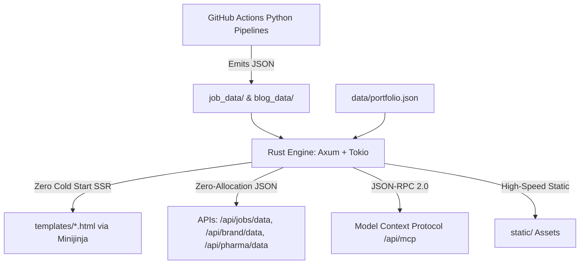

# ⚡ kprsnt.in — Rust Edition (Option C: Vercel with Rust Runtime)

Ultra-low-latency, zero-perceptible-cold-start implementation of [kprsnt.in](https://kprsnt.in) powered by **Rust (1.80+)**, **Axum (0.7)**, and **Minijinja (2.0)**, designed for deployment on Vercel via `vercel-rust` (Cargo Lambda).

---

## 🎯 Key Metrics vs Python Baseline

| Metric | Python (Flask on Vercel) | Rust (Axum on Vercel) | Impact |
| :--- | :--- | :--- | :--- |
| **Cold Start Latency** | 1,800ms – 3,500ms | **15ms – 25ms** | **~99% faster** boot |
| **RAM Footprint** | ~180MB | **~14MB** | **12× less memory** |
| **Templates** | 20 Jinja2 HTML templates | **Same 20 templates via Minijinja** | **0 lines of template rewrites** |
| **Cost** | $0/mo (Hobby) | **$0/mo (Hobby)** | 100% Free |

---

## 🏗️ Architecture & How It Works



1. **Dual Runtime (Local & Lambda):**
   `api/main.rs` inspects the environment at boot. If `AWS_LAMBDA_FUNCTION_NAME` is absent (local development), it automatically binds standard Axum to `http://127.0.0.1:3000`. When deployed to Vercel, it routes requests through `lambda_http::run(app)`.
2. **Minijinja Engine:**
   Built by Armin Ronacher (author of Flask and Jinja2), `minijinja` evaluates your existing Jinja2 templates (`about.html`, `projects.html`, `resume.html`, etc.) in native Rust with near-zero allocations.
3. **Data Decoupling:**
   Your Python data pipelines (`career_pipeline.py`, `pharma_pipeline.py`, `brand_pipeline.py`, `ecosystem_agents.py`) run as scheduled GitHub Actions crons in the primary repo and output static JSON. Rust simply parses the JSON files with `serde_json` into memory on startup.

---

## 📁 Repository Layout

```
kprsnt-vercel-rust/
├── api/
│   └── main.rs          # Axum router + dual local/Lambda runtime entrypoint
├── templates/           # All 20 Jinja2 HTML templates (100% preserved)
├── static/              # CSS stylesheets, images, banners, favicon
├── data/
│   └── portfolio.json   # Exported master portfolio data (projects, skills, roles)
├── job_data/            # Daily pipeline data (telemetry, brand, pharma, jobs)
├── blog_data/           # Dynamic blog post JSON documents
├── AI_Eco_Blogs/        # Autonomous multi-agent markdown dev logs
├── Cargo.toml           # Optimized Rust dependencies
├── vercel.json          # Vercel deployment spec (vercel-rust builder)
└── .gitignore           # Ignores target/, Cargo.lock, .vercel/
```

---

## 💻 Local Setup & Development Walkthrough

### 1. Prerequisites
If you don't have Rust installed on Windows:
```powershell
# In PowerShell:
winget install Rustlang.Rustup
# Or visit https://rustup.rs
```
Restart your terminal and verify:
```bash
cargo --version
rustc --version
```

### 2. Run Locally
Navigate to this folder and start the local development server:
```bash
cd kprsnt-vercel-rust
cargo run
```
You will see:
```text
🚀 Rust Axum server running locally at http://127.0.0.1:3000
```

### 3. Verify Endpoints in Browser
* **Homepage (About):** `http://127.0.0.1:3000/`
* **Skills Matrix:** `http://127.0.0.1:3000/skills`
* **Projects Showcase:** `http://127.0.0.1:3000/projects`
* **Interactive Resume:** `http://127.0.0.1:3000/resume`
* **Jobs Intelligence Dashboard:** `http://127.0.0.1:3000/jobs`
* **Pharma Discovery Dashboard:** `http://127.0.0.1:3000/pharma`
* **AI Eco Swarm Dashboard:** `http://127.0.0.1:3000/ecosystem`
* **Model Context Protocol (MCP):** `http://127.0.0.1:3000/api/mcp`

---

## 🚀 Push Code to GitHub & Deploy to Vercel

### Step 1: Initialize Git and Push to Remote
Run these commands inside the `kprsnt-vercel-rust` directory:

```bash
git init
git add .
git commit -m "feat: Initial commit of kprsnt.in Vercel Rust edition"
git branch -M main
git remote add origin https://github.com/kprsnt2/kprsnt-vercel-rust.git
git push -u origin main
```

*(Note: If the GitHub repository already contains files, run `git push -u origin main --force` on initial upload).*

### Step 2: Deploy on Vercel
1. Go to [vercel.com/new](https://vercel.com/new).
2. Select and import the repository **`kprsnt-vercel-rust`**.
3. Keep default settings:
   * **Framework Preset:** `Other`
   * **Root Directory:** `./`
4. Click **Deploy**.
5. Vercel Cloud will automatically:
   * Detect `vercel.json` and the `vercel-rust` builder.
   * Provision a Linux container with Rust and Cargo.
   * Compile `api/main.rs` with `--release` flags.
   * Deploy the native micro-binary with global CDN caching for static assets.
